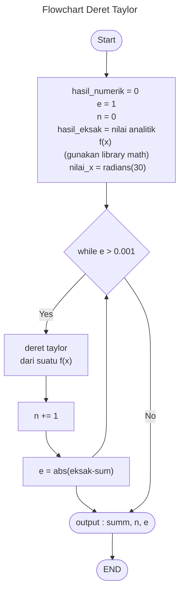

```mermaid
---
title : Flowchart Deret Taylor 
---
flowchart TD
    A([Start]) --> B["hasil_numerik = 0 <br> e = 1 <br> n = 0 <br> hasil_eksak = nilai analitik f(x) <br> (gunakan library math) <br> nilai_x = radians(30)"]
    B --> D{while e > 0.001 }
    D -->|Yes| E["deret taylor <br> dari suatu f(x)"]
    E --> F["n += 1"]
    F --> G["e = abs(eksak-sum)"]
    G --> H["output : summ, n, e"]
    G --> D
    D -->|No| H(["output : summ, n, e"])
    H --> Z([END])
```
